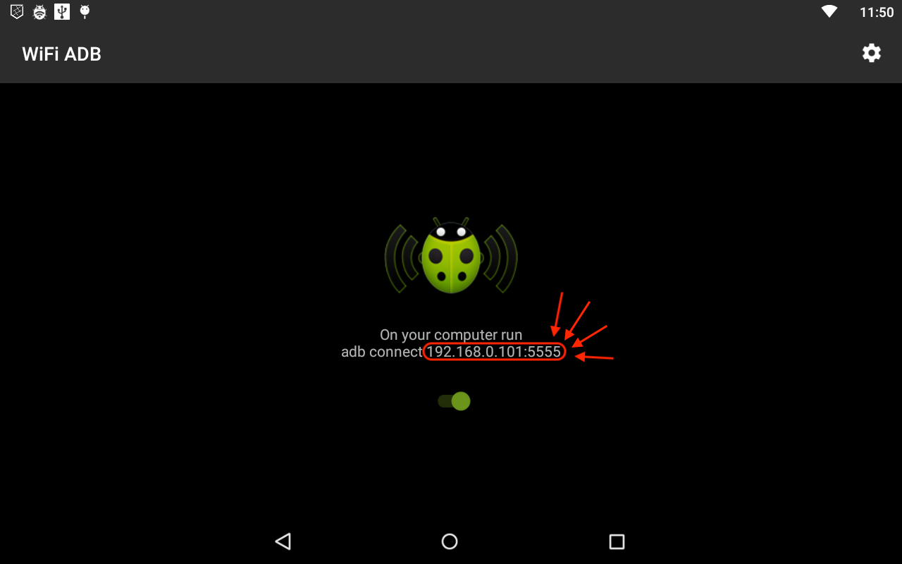

# Investment Game Services

This directory contains Pepper's tablet app for the investment game experiment.

### Getting Started

The latest version of the game should already be loaded on Pepper's tablet. If so, open the app, follow the initial configuration prompts and you're all set!

If the application is not installed, you will need to sideload it.

> **NOTE:** The tablet sets the animation scale on reboot to `0`. Make sure all scale parameters are set to `1`. Go to _`Settings > Developer options`_ and look for:
>
> - _Window animation scale_
> - _Transition animation scale_
> - _Animator duration scale_

### Prerequisites

Before installing the app, make sure you have the following:

- **Android Studio (recommended)** to build the application
- **ADB (Android Debug Bridge**) installed on your machine
- Pepper’s tablet connected to the same Wi-Fi network as your computer

> **NOTE:** Installing Android Studio first should also install platform-tools (ADB) as well, so you can just skip the second step.

> **NOTE:** The tablet does not behave well with direct deployment from Android Studio. You must use Wi-Fi ADB and sideload the APK manually.

### Installation Guide

#### 1. Enable Wi-Fi ADB on the Tablet

1. Open the **WiFi ADB** app on the tablet.
2. Toggle the switch **ON**.
3. Once enabled, the tablet’s IP address will appear in the app or in the status bar notification.
4. Take note of the IP address (it will look something like `192.168.0.101:5555`).



#### 2. Connect to the Tablet via ADB

On your computer, open a terminal and run:

```bash
adb connect <IP_ADDRESS>
```

If successful, you should see something similar to:

```bash
connected to 192.168.0.101:5555
```

You can verify the connection with:

```bash
adb devices
```

#### 3. Build the Application

The easiest way to build the APK is using **Android Studio**:

1. Open the project in Android Studio.
2. Go to:

```
Build -> Build Bundle(s) / APK(s) -> Build APK(s)
```

3. Locate the generated APK (usually in):

```
app/build/outputs/apk/debug/app-debug.apk
```

#### 4. Sideload the APK via ADB

Once the APK is built and your tablet is connected via Wi-Fi ADB:

```bash
adb install -r path/to/app-debug.apk
```

#### 5. Make Application a Device Admin

For the Kiosk mode to persist, you need to make the app a device owner:

```bash
adb shell dpm set-device-owner se.chalmers.investmentgame/.GameDeviceAdminReceiver
```

#### 6. Profit?

You can find the application in the app drawer. Before conducting an experiment, start the app, follow the initial configuration prompts and you're good to go!

> **NOTE:** Since the app enables Kiosk mode as soon as the experiment starts, you cannot leave the application.

To exit Kiosk mode, run on a computer connected to ADB:

```bash
adb shell am broadcast -a se.chalmers.investmentgame.EXIT_KIOSK
```

You can also long press on the root view of a KioskActivity for 10 seconds to exit Kiosk mode.
